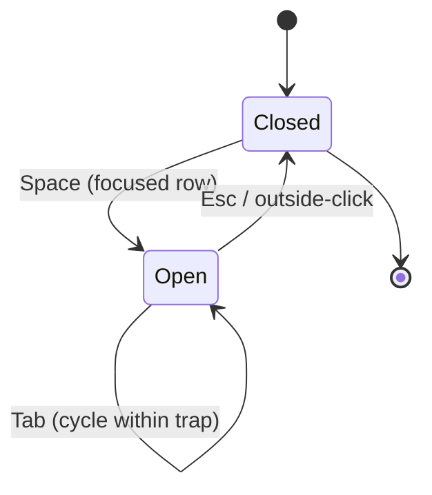
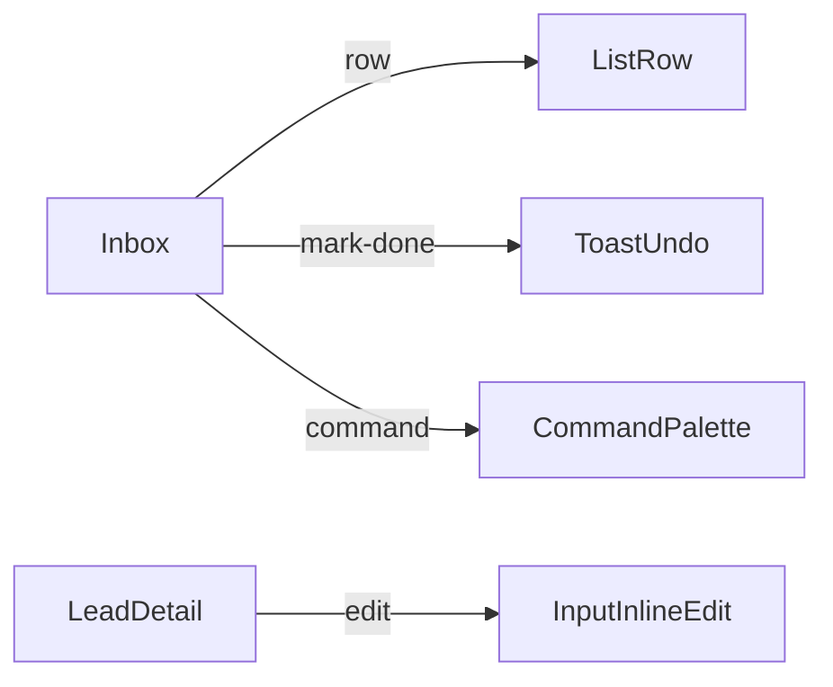

# Handoff spec template (behavior-first-design)

The OUTPUT artifact written at spec-write time. Lands at `<project-root>/docs/behavior-first-design/<YYYY-MM-DD>-<slug>.md`. Three audiences: human review, git versioning, downstream `superpowers:writing-plans`.

## Shape

````markdown
---
project: "<name>"
date: YYYY-MM-DD
domain: <inherited from upstream>
inputs:
  - {surface: <name>, primary_modality: keyboard, secondary: pointer, declined: touch}
keyboard:
  global: {⌘K: command-palette, "g i": jump-to-inbox, ...}
  per_surface: {<surface>: {<chord>: <action>, ...}}
response_time:
  - {action: <name>, target: <ms>, optimistic: <bool>}
feedback:
  - {action: <name>, signal: <toast+undo|confirm|progress|inline-validation>, recovery: <description>}
motion_fire_policy:
  frequent_low_novelty: instant
  rare_high_novelty: <range>ms ease-out
  boundary_marker_exception: 150ms
components_used: [<Common-18 IDs>]
constraints_from_upstream:
  - "<inherited from structural + visual specs>"
canonical_voices_used: [<voice slugs>]
user_voices: []
---

# <project> — behavior spec

## Inputs
<per-surface modality priority paragraph + table>

## Focus & Keyboard
<chord map + focus state machine per surface>

### Focus state machine: Peek (Mermaid; optional but recommended per focus-trap surface)



(Emit one `stateDiagram-v2` per focus-trap surface — dialogs, peeks, command palettes, popovers.)

## Response-time & Optimism
<budget table + optimistic-UI inventory + rationale>

## Feedback & Recovery
<per-action recovery decisions + validation timing + accessibility rows>

## Motion fire-policy
<frequency-novelty matrix output; cite visual-design tokens for durations>

## Component binding
<surface × action × component × contract table>

### Binding map (Mermaid; optional, complements the table)



(Useful when the binding table grows large; the Mermaid graph makes the surface→component mapping scannable. The table remains primary.)

## Constraints from upstream specs
<inherited from structural + visual specs; not re-derived>

## User-cited voices
<project-local voices captured during dialogue>

## Decisions log
<per-layer one-line entries: chose X over Y because <derivation rationale>>
````

## Validation at spec-write time

The skill verifies before finalizing:

- YAML frontmatter parses
- All 12 frontmatter keys populated (project, date, domain, inputs, keyboard, response_time, feedback, motion_fire_policy, components_used, constraints_from_upstream, canonical_voices_used, user_voices)
- All 6 layer H2 sections present (Inputs / Focus & Keyboard / Response-time & Optimism / Feedback & Recovery / Motion fire-policy / Component binding)
- Component-binding table has rows for every surface-action from upstream structural spec's Flows
- All component IDs are from Common 18 (no inventions)
- Reduced-motion contract acknowledged in Motion fire-policy section
