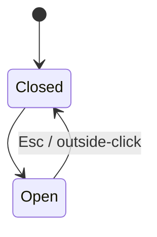

# Focus & Keyboard

Define chord map, tab order, focus trap, focus restoration policy per surface; emit `keyboard:` frontmatter.

## Canon

- `keyboard-and-focus.md` — full canon on focus management and keyboard discipline; focus rings, trap contracts, restoration policies, chord-map structure.
- `canon/apple-hig-foundations.md § Inputs` — HIG focus system; focus rings are a first-class affordance, not an accessibility afterthought; macOS and iPadOS carry distinct focus semantics.
- Linear chord conventions (`g i` / `g l` / `g p` navigation jumps, `⌘K` command palette) — cited from voices/linear; the reference point for a keyboard-primary tool with discoverable chord discipline.
- Gmail / Superhuman J/K navigation precedent — row-level navigation for list surfaces; J moves down, K moves up, Enter opens, Esc closes; canonical for any inbox-model surface.

## Derivation method

**Named method: chord-map + focus-state machine per surface.** Four passes, run sequentially.

**Pass 1 — Walk Layer 1 (Inputs).** For each `keyboard-primary` surface in the `inputs:` frontmatter, schedule it for chord-map derivation. `pointer-primary` and `touch-primary` surfaces get no chord map — focus rings only, tab-order pinned by DOM structure, no custom traps unless they contain embedded dialogs or palettes.

**Pass 2 — Global chord map.** Derive chords active across all keyboard-primary surfaces. Canonical set: `⌘K` palette, `g i/l/p` navigation jumps, `n` new (context-aware), `?` shortcuts cheatsheet. Global chords must not conflict with any per-surface chord. Omitting `?` is an anti-pattern: discoverability collapses (Hick's Law) when chords exist but the map is hidden.

**Pass 3 — Per-surface chord map.** For each keyboard-primary surface, derive chords active only when that surface holds focus. Canonical list/inbox set: `J/K` row nav, `Enter` open, `Space` peek, `Esc` close, plus surface verbs (`x` mark-done, `s` snooze, `e` edit). No per-surface chord may duplicate a global chord; the skill checks for conflicts before proposing.

**Pass 4 — Focus state machines for trap surfaces.** For every surface that captures focus (dialogs, peek panels, command palette, popovers), define: `trigger → trap target → restore target → escape`. Trap target = first interactive element inside the surface. Restore target = element focused before the trap opened. Escape = key or action that closes and restores.

**Worked example — Pine IRM inbox:**

Global: `⌘K` palette, `g i/l/p` jumps, `n` new lead, `?` cheatsheet. Per-surface (inbox): `J/K` row nav, `Enter` open, `Space` peek, `Esc` close, `x` mark-done, `s` snooze. Focus state machine for peek — trigger: `Space` on focused row; trap target: first interactive element in peek; restore target: originating row; escape: `Esc` closes, focus returns.

Anti-pattern: hidden chords with no `?` cheatsheet. If chords exist but `?` is absent, discoverability fails under Hick's Law (search cost rises with hidden options) and Jakob's Law (users expect the pattern from Gmail and Linear). Cheatsheet is non-negotiable on any keyboard-primary surface.

## Required output

The Focus & Keyboard layer populates two artifacts in the handoff spec:

- `keyboard:` frontmatter — `global` sub-key (chord → action pairs active across all surfaces) and `per_surface` sub-key (one block per keyboard-primary surface with its chord map and `focus_traps` list containing the four-part state machine per trap surface).
- `## Focus & Keyboard` body section — prose citing the Layer 1 `inputs:` decisions and canon that drove global chords, per-surface maps, and focus-state-machine choices.

## Dialogue questions

The Focus & Keyboard layer runs exactly three questions. The skill waits for the user's answer before advancing.

**Question 1 — Global chord map.** The skill proposes the full global map derived from canon and the structural spec:

> "Global chords (work across all surfaces). My lean: `⌘K` (palette), `g i` / `g l` / `g p` (jumps), `?` (shortcuts), `n` (new). Linear/Gmail precedent. Pick or override."

Expected answer: confirmation or a list of overrides (add / remove / remap). After confirmation, cite precedent: Linear's `g` + letter jump pattern; Gmail / Superhuman's `J/K` + `?` as canonical for inbox-model tools.

**Question 2 — Per-surface chord map.** One surface at a time, each keyboard-primary surface from Layer 1:

> "Surface `<name>`: J/K row nav, Enter open, Esc close + `<surface-specific chords>`. Pick or override."

Expected answer: confirmation per surface, or per-chord overrides. The skill checks each proposed map against the committed global map and flags conflicts before asking the user to confirm.

**Question 3 — Focus-state machines.** For all trap surfaces (dialogs, peeks, command palette):

> "Surfaces with focus traps: dialogs, peeks, command palette. Per surface: trigger → trap target → restore → escape. My lean: `<per-surface block>`. Pick or override."

Expected answer: confirmation, or overrides to trigger key, trap target element, restore target, or escape key.

## Constraint surfacing

Before Question 1, surface these constraints if applicable:

- **Keyboard-primary surfaces** — focus ring floor is 2px visible outline (WCAG 2.4.7 floor); the visual-design layer cannot dissolve it.
- **Reduced-motion mode** — focus-flash animations are disabled; focus ring alone must communicate where focus lands; no chord-nav behavior may depend on animation.
- **Touch-primary surfaces** from Layer 1 — excluded from chord-map derivation; no custom traps unless they contain embedded dialogs or palettes.

## Options pattern

Derivation-based first. The skill leads with "my lean is X because…" and cites the specific Layer 1 `inputs:` decisions (which surfaces are keyboard-primary) and canon (Linear conventions, Gmail/Superhuman J/K precedent) that produced each proposed chord.

After the user confirms, cite peer precedent as evidence — not source. Linear: `g` + letter jumps and `⌘K` palette are the canonical chord grammar for a keyboard-primary tool. Gmail / Superhuman: J/K + `?` cheatsheet are canonical for inbox-model surfaces. Vim: J/K as muscle-memory anchor explains why J/K is preferred over arrow keys. Framing is always "Linear establishes this pattern for similar reasons" — derivation stays primary.

## User-voice prompt

At the end of the Focus & Keyboard layer, after Question 3:

> "Any keyboard reference beyond canonical voices? Drop a name."

Captured references queue for research — do NOT fetch during dialogue. User-supplied references populate `user_voices:` frontmatter and `## User-cited voices` in the spec.

## Principles invoked

`keyboard-and-focus.md`, `canon/apple-hig-foundations.md § Inputs`, `voices/linear.md` (chord conventions), Gmail / Superhuman J/K nav precedent (consult plugin canon).

## Gate criteria

- [ ] Global chord map committed
- [ ] Per-surface chord maps committed (one per keyboard-primary surface from Layer 1)
- [ ] Focus state machines defined for all focus-trap surfaces
- [ ] No duplicate chord assignments across global + per-surface (chord conflicts surfaced)
- [ ] User has confirmed the layer's block in the handoff spec

## Transition prompt

```
Focus & Keyboard captured. (Layer 2 of 6 in behavior-first-design; skill 3 of 3 in product-design pipeline.)
Ready to move to Response-time & Optimism, or should I revise? (yes / revise)
```

## Mermaid output (optional but recommended; per focus-trap surface)

Emit a Mermaid `stateDiagram-v2` per focus-trap surface (dialogs, peeks, command palettes, popovers). The diagram complements the table — table is primary; diagram makes the trap/restore lifecycle scannable.

Format:



Renders on GitHub / claude.ai / Cowork; degrades to text in CLI.
